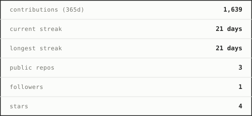

27 · ai engineer and founder @alwayslate

i build systems around what matters to me: minimalism, security and control. software made by a user, for users.

i try to give simple answers to complex problems. i'm passionate about music, drawing, film photography, 3d and art in general.

[portfolio & journal](https://appellemoipizza.github.io) · [linkedin](https://www.linkedin.com/in/thomasv26)

